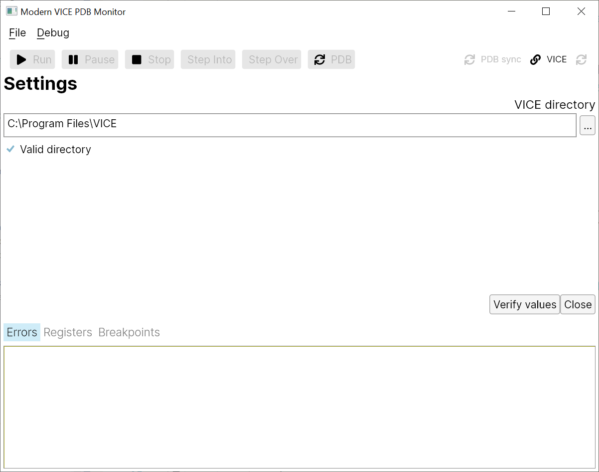
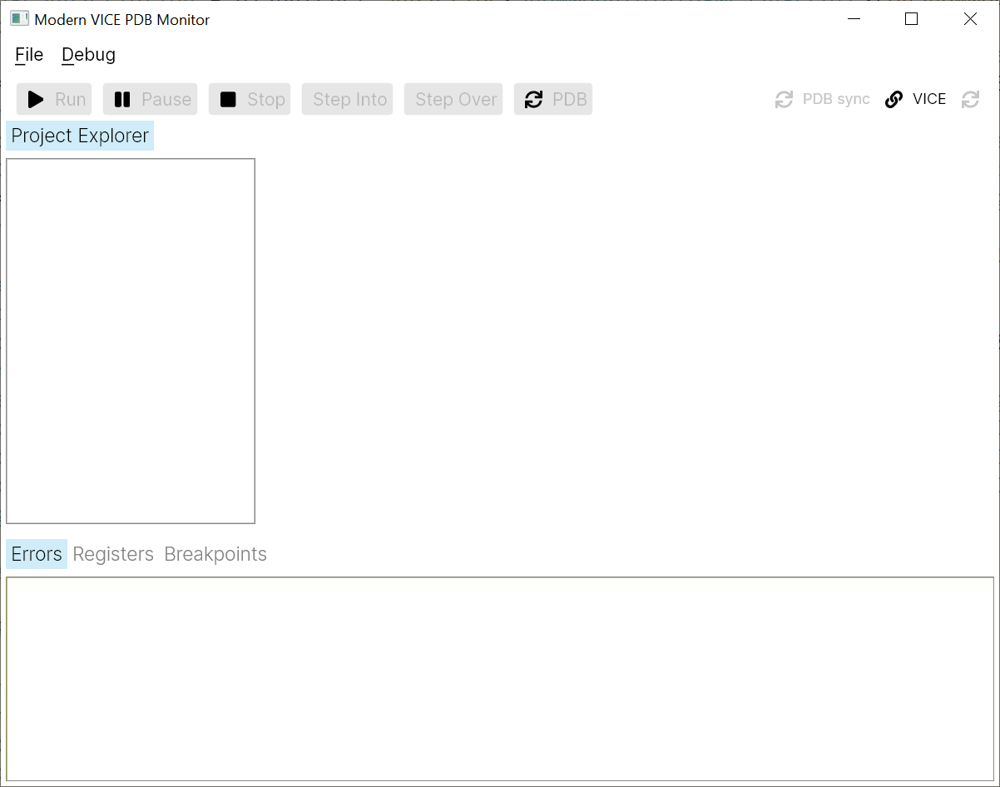
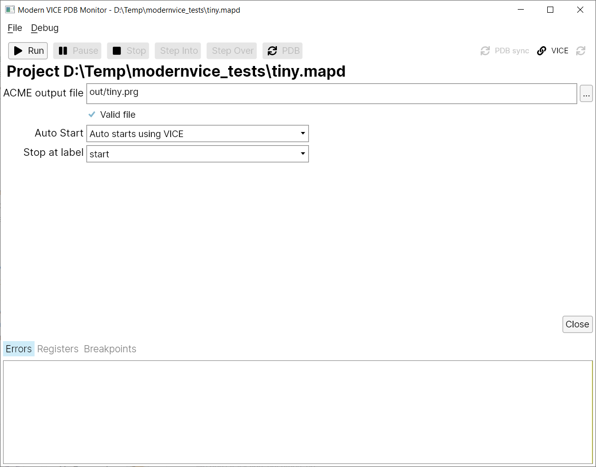
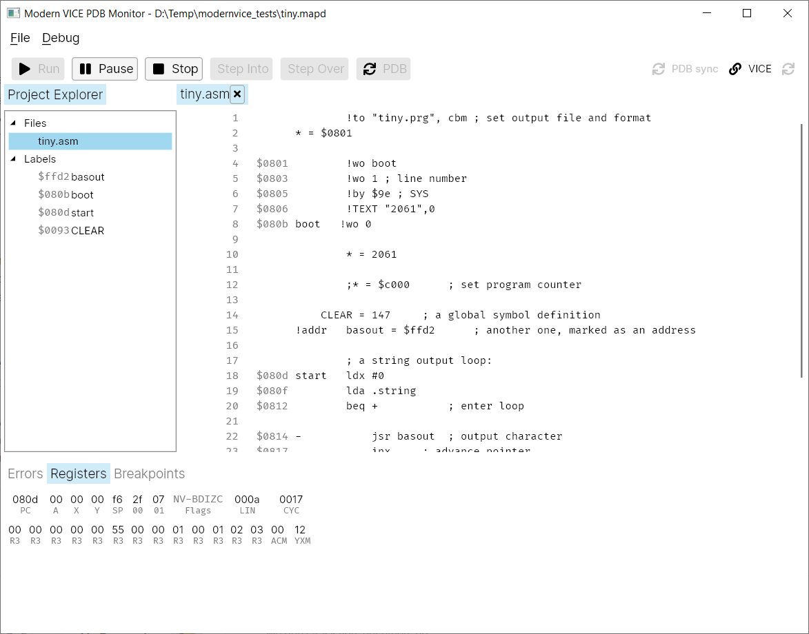
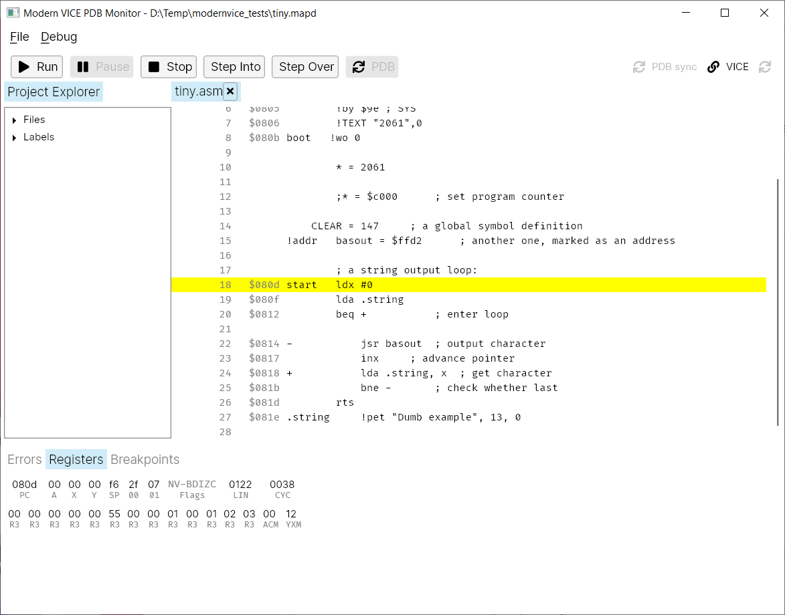
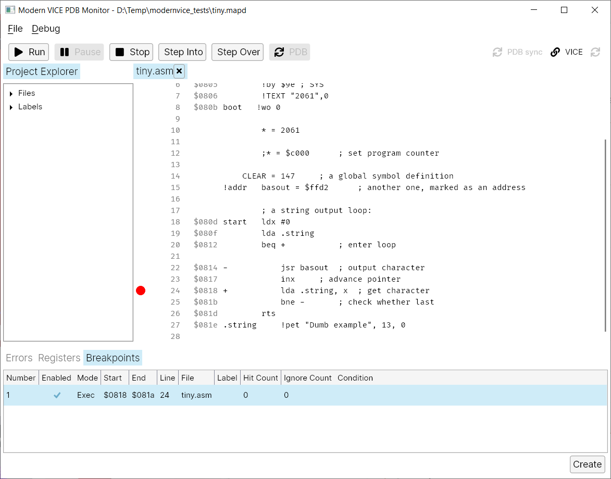
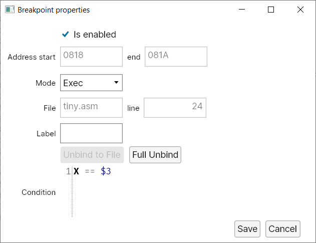

# Modern VICE PDB monitor

This is a project that provides a cross platform debugging environment for [VICE emulator](https://vice-emu.sourceforge.io/). It's build with .NET 7 and using [Avalonia](https://docs.avaloniaui.net/) as UI. The goal is to create a nice environment for debugging VICE apps built with [ACME Cross-Assembler](https://sourceforge.net/projects/acme-crossass/) while learning Avalonia, VICE and C64 machine language at the same time. Currently I'm testing only on Windows 10, but it might just work on Linux and MacOS as well. For communication with VICE it is using my other project [VICE Binary Monitor Bridge for .NET](https://github.com/MihaMarkic/vice-bridge-net).

App is currently in *alpha* state. Feel free to open issues, if you are in a mood for contributing a PR, ask first. Find binaries in the Release section, for now just win-x64. If you want to run it on another OS, compile it your self: just clone repo, open solution and compile it. Or just use *dotnet* command line.

## Getting started

### Requirements

ACME Cross-Assembler, VICE emulator.

### Steps

#### 1. Prepare C64 application

A simple application taken from ACME Cross-Assembler samples looks like:

``` asm
		!to "tiny.prg", cbm	; set output file and format
* = $0801

        !wo boot
        !wo 1 ; line number
        !by $9e ; SYS
        !TEXT "2061",0
boot   !wo 0
 
        * = 2061

		;* = $c000		; set program counter

	CLEAR = 147		; a global symbol definition
!addr	basout = $ffd2		; another one, marked as an address

		; a string output loop:
start	ldx #0
		lda .string
		beq +			; enter loop

-			jsr basout	; output character
			inx		; advance pointer
+			lda .string, x	; get character
			bne -		; check whether last
		rts
.string		!pet "Dumb example", 13, 0
```

The actual app starts at *start* label while the code in front makes it accessible from BASIC. The app itself just prints "Dumb example" text to C64 screen. 

1. Copy this code and save it into *Sample* directory somewhere, like *Sample/tiny.asm*.
2. Make subdirectory *out*.
3. Compile the code using arguments for creating debug information
   `acme -r out\tiny.report --vicelabels out\tiny.labels -o out\tiny.prg  -f cbm .\tiny.asm`
   It will generate machine code and meta data in the *out* directory. Extensions *.labels* and *.report* are important. Also the *cbm* format. Do not modify them.

### Debug

1. Install or compile the source.

2. Run *Modern.Vice.PdbMonitor.exe* (or an equivalent when not on Windows).

3. Upon start Settings dialog is open. Enter path to VICE. This information will be used to autostart VICE when required. Click Close. The Settings dialog will appear always at the start unless path to VICE is set.
   

4. Next the application without a project set is displayed.
   

5. Use *File/New...* to create a new project. Name it *tiny* (.mapd extension will be added) and place it into the *Sample* directory. Open *File/Project Settings...* and set path to *tiny.prg* file created when tiny.asm was compiled (path is relative to project).
   There are two ways to auto start the app. Using VICE which will start code from beginning (the first code block uses BASIC to start the app). Or use *Auto starts at 'start' label address* option which start the app at address defined by *start* label. Stop at label gives you the option to stop execution at certain label after auto start. This is mostly useful in combination with VICE auto start since we want app to stop at user code, not at bootstrap as in this case.
   Set Auto Start to *Auto starts using VICE* and Stop at label to *start*.
   Click *Close*.

6. Explorer is now populated with files and labels, both can be double clicked and open the code in the code viewer. Registers panel shows the current registers values.

   

7. Click the *Run* button to start the application. It will stop at *start* label.
   

8. Click *Run* again and app will complete. Since app has no real stop, app will still be showing as running. VICE will show this result.
   

9. A breakpoint can be also set. Click on left of the line numbers to automatically create a breakpoint. All breakpoints are listed in *Breakpoints* panel (breakpoint might be using arbitrary address, not a source line one). If you run the app now, it will stop at given breakpoint after second click on *Run*.
   

10. Breakpoints can be modified (right click on breakpoint in the list and *Properties* or double click on it) or created manually (*Create* button). When breakpoints are created like in previous step, they are linked to file and its line. To unbind it, click *Full Unbind*. When breakpoints are linked to label, they can be first unbound to file using *Unbind to file*. Once the breakpoint is fully unbound, its address start and end can be modified.
    Condition window lets you add a condition upon which the breakpoint is triggered. See [Checkpoint commands](https://vice-emu.sourceforge.io/vice_12.html) for condition syntax (enter only <cond_expr> in the input). Sample condition would be
    `X == $3` which trigger the breakpoint only when register X has value of $3. 
    Breakpoints can be also disabled through *Is enabled* flag.

    

## Features

* Auto starts VICE if required
* Registers display
* Breakpoints support
* Source code viewer
* Automatically reloads debugging symbols upon start when sources are compiled
* Cross platform
* Will add other features through time
